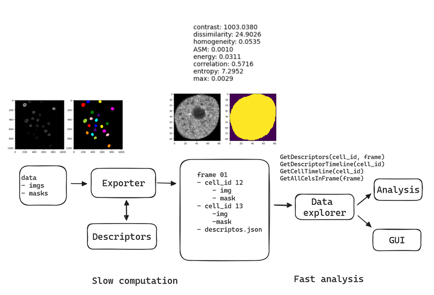

# Cell Descriptor
The Cell Descriptor Library serves as a tool designed to streamline the analysis of diverse descriptors, including mask descriptors and texture descriptors, within 2D+t datasets of cells. Examples of such datasets can be found at Cell Tracking Challenge (http://celltrackingchallenge.net/). This project was developed during PV162 course at FI MUNI.




## Components 
Before installing any packages, we recommend using a virtual environment:
```
python -m venv env
./env/Scripts/activate
```
To install required packages and the lib it self, run:
```
pip install -r .\requirements.txt
pip install .
```
### DescriptorLib 
- `descriptors.py` - module contains library of various descriptors
- `descriptor_provider` - contains list of all implemented decriptors
### Exporter
Command line tool for running the computation on the dataset. Example usage
```
python .\src\DescriptorLibUtils\export.py .\tests\testdata\images\ .\tests\testdata\masks\
```
### Data explorer
Module for simple parsing of the directory structure. First, inicialize the module:
```python
from DescriptorLibUtils import DataExplorer
de = DataExplorer("../output/")
```

And then you can simply use objects method to explore the data:

```python
desc = de.GetDescriptorsForCell(frame_number,cell_id)["Mask descriptors"]
imgs, masks = de.GetCellTimeline(cell_id)
mask_timeline = de.GetCellDescriptorTimeline(cell_id, "Mask descriptors")
```


